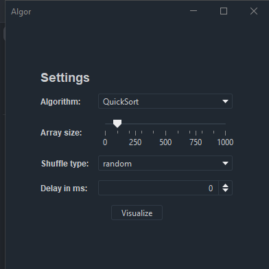
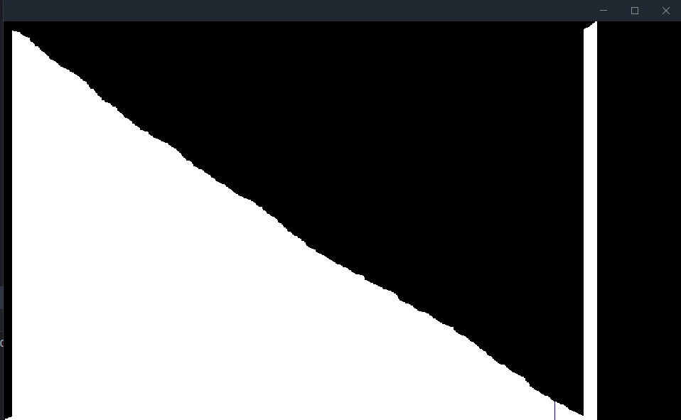

# Algor
a simple UI application to visualize sorting algorithms

## Usage
if you run the project you will see a configuration window in which you can configure the following things:
- the algorithm which will be used
  - quicksort
  - bubblesort
  - mergesort
  - add your own it's not that difficult :)
- the size of the array which will be sorted (may need to resize the window if the array is to big)
- how the array will be shuffled
  - random generates a random array
  - sorted generates a sorted array
  - reversed generates the opposite of a sorted array
- the delay in ms between each iteration (0ms is so fast you won't be able to see anything)   

## Demo

## Feature Ideas
- add live metrics to the visualization
- add more algorithms
